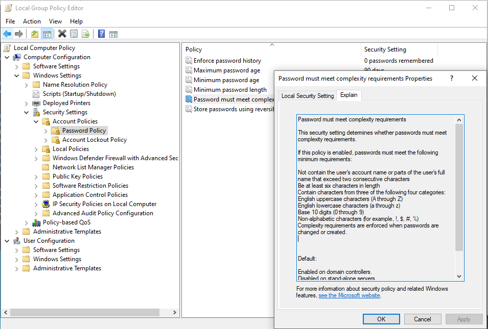

## 7.1 Student Guide: Introduction to Windows and `CMD`

### Class Overview

Today's class begins our unit on Windows administration and hardening. You will be introduced to to the Windows operating system and command line by performing basic system administration tasks in Windows 10.

### Class Objectives

By the end of class, you will be able to:

- Leverage the Windows command prompt (`CMD`) to execute various sysadmin responsibilities. 
- Use `wmic`, Task Manager, and `services.msc` to manage applications and services.  
- Create, manage, and view user information using the command-line tool `net`.
- Manage password policies using `gpedit`.

- Schedule tasks using Task Scheduler.

### Lab Environment

Note that your RDP host contains two nested virtual machines. Specifically, these nested VMs are:

- A **Windows Server** instance, which you will use later this week
- A **Windows 10** instance, which you will use in class today.

All demonstrations and activities will be done within the **Windows 10 VM**.

- Credentials for the Windows RDP machine:
  - Username: `azadmin`
  - Password: `p4ssw0rd*`

- Credentials for the Windows 10 VM for Day 1 Activities:
  - Username: `sysadmin`
  - Password: `cybersecurity`

Because we are using a virtualized environment for the Windows 10 machine, the screen resolution may not fill the entire screen during demos. 

To adjust screen resolution:

- Log into the Windows 10 VM and right-click anywhere on the screen.
- In the new tab that opened scroll down to **Display Settings**. 
- A new **Display** window will pop up. Navigate to **Display resolution** and adjust the resolution to match your screen from here.

#### Saved State Clearing

Hyper-V VMs should be shut down after every session to avoid the HyperV Machine going into a hibernation known as a 'Saved State'. If a machine goes into a saved state, you may see the error `The application encountered an error while attempting to change the state of the 'VM-Name'.` 

- If you see this error, the VM may not startup until you _delete the saved state_. Turning the VM's and the host machine off when not in-use will avoid this troubleshooting overhead.

To delete the saved state, run the following PowerShell line to clear the Hyper-V virtual machine _saved states_:

- `Get-VMSnapshot | Remove-VMSavedState`.

**Note:** If you are unsure how to launch PowerShell, click on to the bottom left `Start` menu button and type "PowerShell".

**Note:** that if, at any point, you come across an error that says `The application encountered an error while attempted to change the state of...` when starting up your virtual machines, you rill need to run `Get-VMSnapshot | Remove-VMSavedState` again.

After deleting the saved state, you can turn on the **Windows 10** and **Windows Server** virtual machines by running:

  - `Get-VM | Start-VM`
  
  
#### Differentiating between lab host machine and Windows 10 VM

Due to the lab machine and the Windows 10 virtual machine having the same background, it can make it confusing for you to know which machine they are working on. It is highly advised that you change the background for the lab machine (the one you RDP connect to) by doing the following:

- Right-click the Azure lab machine's desktop and select `Personalize`.

- On the `Personalize` page, you should change the background to something of your liking or a solid background color so that you know **NOT** to make any IP configuration changes to this machine

### Additional Resources

- [SS64 Windows Environment Variables](https://ss64.com/nt/syntax-variables.html)

- [SS64 Command-line info about WMIC](https://ss64.com/nt/wmic.html)

- [Microsoft Documentation on WMIC](https://docs.microsoft.com/en-us/windows/win32/wmisdk/wmic)

- [Net User Commands](https://www.digitalcitizen.life/how-generate-list-all-user-accounts-found-windows)

- [Adding Users from CMD](https://www.wikihow.com/Add-Users-from-CMD)

### Lesson Slideshow and Time Tracker

- The slides for today can be viewed on Google Drive here: [7.1 Slides](https://docs.google.com/presentation/d/1ffFQ_s-tOFg0UtkERBqYgfuZEy581EXvVGi4NXPdqUU/edit#slide=id.g4f80a3047b_0_990)


- **Note**: Editing access is not available for this document. If you  wish to modify the slides, please create a copy by navigating to File > "Make a copy...".

### Important Note on Shutting Down VM

HyperV VMs should be shut down after every session to avoid the Hyper-V Machine going into a hibernation known as a 'Saved State'. 

- If a machine goes into a saved state, you may see the error `The application encountered an error while attempting to change the state of the 'VM-Name'.` 

- If you see this error, the VM may not startup until you delete the saved state. 

- Turning the VMs and the host machine off when not in-use will avoid this troubleshooting overhead.

To delete the saved state, using the Hyper-V manager, go to the `Action` dropdown and choose `Delete saved state`.

---
### 01. Introduction to Windows

Today's lesson will introduce the fundamental concepts and details related to the Windows operating systems.

- Despite many IT professionals preferring Mac OS and Linux for their operating systems, Windows is still the market leader for desktop operating systems.

The ubiquitous usage of Windows as personal computers and workstations makes them the most common target for today's attackers. 

- Much of the malware that exists today specifically targets vulnerabilities in unpatched and unsecured Windows personal computers and servers.

- Therefore, as a security professional, you will likely interact with Windows—whether it's the operating system you use daily, or as part of your company or client's infrastructure.

Understanding Windows is essential for the following IT and cybersecurity specializations:

- **SOC Analyst**: As an SOC, or security operations center analyst, your familiarity with Windows will be tested nearly every day. As part of your daily routine, you may observe anywhere from one or two, to several thousand security-related incidents and alerts dealing with Windows endpoints.

- **Systems Administration**: The large majority of system administrators work with one or more Microsoft products and/or services: Windows PCs, Windows Servers, Office 365, and Exchange to name a few.

- **Penetration Testing**: Due to Windows workstations and servers being widely used in organizations and businesses, it is vital that penetration testers know how to exploit Windows and Microsoft-related products.

- **Endpoint Forensics**: Because the most commonly supported endpoint device in an organization is likely to be Windows, it is critical that forensics investigators understand how Windows works, at a granular level.

Today's activities and demonstrations will cover common system administration tasks utilizing command line and GUI tools to troubleshoot a problematic Windows PC. During this process, we will create a report with our findings.

You will complete the following tasks throughout the day:

- Audit processes with Task Manager.

- Use the command line to gather information and create files.

- Enforce password policies.

- Manage users.

- Automate tasks.

You will be learning the "Windows way" of performing basic system administration tasks they've already learned to do on Linux. 

### 02. Launching Your Windows Lab (0:10)

We'll begin by setting up our Azure Lab Environment. Follow these instructions alongside your instructor. 

#### Log into Azure Labs

1. Use RDP to log into their Azure lab. 

    - Credentials for the Azure RDP Host:
    - Username: `azadmin`
    - Password: `p4ssw0rd*`

2. Launch the **Hyper-V Manager**:

    - Click the bottom-left Windows icon (the Start Menu button) in the Azure RDP host.
    - Type "Hyper-V" in the search to show the **Hyper-V Manager** application.
    - Click on **Hyper-V Manager** to launch the Azure virtualization lab.

This **Hyper-V Manager** is equivalent to the **VirtualBox Manager**. It manages and launches virtual machines within our Azure environment.

#### Increase Hyper-V Virtual Machine Resource Allocations

Before we start today's lessons, we need to ensure that we have proper resource allocation for our virtual machines. In order to do so, we're going to increase the available RAM and CPU for our Windows 10 virtual machine.

1. In the **Hyper-V Manager**, on the left pane, click  the tabulated entry beneath "Hyper-V Manager". It will look like a combination of letters of numbers (e.g.: `ML-REFVM-370502`).

    - The middle pane will change to show  a list of virtual machines available within our Azure lab.

2. Ensure your virtual machine is shut off by right-clicking the **Windows 10** virtual machine and selecting `Turn Off...`

3. Right-click the **Windows 10** virtual machine and go to **Settings**.

  - Under `Memory`, change the `RAM` to:`8192` MB.

  - Under `CPU`, change the `Number of virtual processors` to `2`

  - Select `Apply`, then `OK` at the bottom to apply these changes.

This will give our virtual machine additional resources from our RDP host machine to run on, improving its performance. Since we are using nested virtualization, it's important to allocate enough resources to maximize virtual machine performance.

#### Launch the Windows 10 Virtual Machine

All of your activities will be done within these virtual machines.

-  Double-click the **Windows 10 virtual machine** to launch it. 

    - Credentials for the Windows 10 VM for today's activities:
    - Username: `sysadmin`
    - Password: `cybersecurity`

**Note**: If you encounters save state issues, run the PowerShell command: `Get-VMSnapshot | Remove-VMSavedState` **within the RDP lab** and attempt to re-launch the Windows 10 VM. See your instructional staff for additional information.


#### Startup Application and Installer Maintenance

The nested Windows 10 machine has a lot of clutter installed on it (which will be addressed later in the day). In order to get started with it this clutter, we will need to close these start-up application windows.

- For any application or installer window that pops up after booting the machine, click the top-right `X` in each Window to close it. If it asks you if you are sure, confirm.

We'll look at how to disable these applications in a few minutes.

#### Extend the Windows Virtual Machine Evaluation License

This Windows 10 virtual machine will require an extension of the evaluation license so that the Windows 10 does not shut down abruptly.

Within the **Windows 10 Virtual Machine**:

1. Select the Windows icon at the bottom-left and begin typing `CMD`.

2. When the `Command Prompt` application shows up, right-click and select `Run as administrator`.

3. Within the administrator CMD terminal window inside of the Windows 10 VM, run the following command:  
    -  `slmgr.vbs /rearm`

4. The virtual machine can then be rebooted by clicking the Windows icon, selecting the power icon above it, then selecting `Restart`.

This will add an additional 90 days to our virtual machine evaluation license and prevent unwanted shut downs that occur from expired licenses.

**Note**: Repeat the same steps within the **Windows Server Virtual Machine** if there is less than 30 days on the evaluation license.

### 03. Everyone Do: Introduction to Task Manager (0:15)

Have you noticed the various processes that started up when we logged into the Windows 10 VM?

- This is what an un-managed Windows workstation may end up looking like if it's not maintained by an organization's system administrators.

- Remember that during the Linux system administration lessons, we learned how to enumerate and inspect running processes using `top`.

#### Introducing Task Manager

Today's first demonstration focuses on cleaning up these unnecessary processes with a Windows process management tool: **Task Manager**.

Understand the following about Task Manager:

- Windows, like Linux, has the same concept of errant/runaway processes
- Therefore, we need a way to inspect and troubleshoot process resource utilization in Windows
- On Windows, we can use the Task Manager GUI to inspect and manage processes, instead of `top`'s CLI
- Because of this, using Task Manager to manage processes is easier than using `top`
- Task Manager also allows us to do manage other important system components, such as start-up processes.

Processes in Windows are much like the processes and PIDs that we worked with in the Linux units.

Some use cases for Task Manager include:

- Some programs, when not in use but left running, may take up excessive resources or even allow for unwanted remote connections. Some examples are:

  - Google Chrome, which is well-known for its high memory usage.

  - Teamviewer, the remote desktop application, has had critical issues that left systems extremely vulnerable within public internet.

- Some processes can even cause memory leaks that can result in system instability and abrupt system crashes. 

 - When a Windows system crashes, you are often stuck with what what is known as the **blue screen of death**.

Security professionals can also use Task Manager audit processes to identify incorrect or malicious processes:

- For example, many cryptojacking processes, or cryptominers, use excessive CPU and/or network resources even while a system is idle.

#### Task Manager Overview

For this upcoming demo, we're going to use Task Manager to identify resource bottlenecks and start-up processes that are potential issues within our Windows 10 machine.

First, we'll walk through how to audit processes based on resource utilization.

On your Windows 10 VM, complete the following steps: 

- Right-click on the Task Bar at the bottom of the Windows desktop and choose `Task Manager`. Expand this window as needed.

- With **Task Manager** launched, make sure you're on the `Processes` tab. 

All running processes on the computer can be seen in this `Processes` tab. 

Each column header shows the resource utilization of each process: `CPU`, `Memory`, `Disk`, and `Network`. These can be sorted in ascending or descending order.

- Click on the `Memory` resource column header.

Click on to the `Performance` tab.

- This tab shows resource utilization visualized in charts. This is useful information for system administrators when there are extended periods of high or abnormal amounts of resource usage.

One of the key functionalities of Task Manager is ending errant processes: processes that are not behaving as they should. 

For example, suppose that we notice spikes in CPU usage. We would need to identify the errant process creating these spikes, and end it.

In our case, we have a process with exceptionally high CPU usage.

#### Task Manager Demo: Terminating the CPU-thrashing Process

This Windows 10 VM may seem to be running slowly and this is due to an unwanted process. Luckily, ending this process is trivial with `Task Manager`.

- With `Task Manager` still open, on the `Processes` tab:

  - Click on the `CPU` column header to sort the CPU by descending resource utilization (`Microsoft Windows Based Script Host` should be at the top).

  - Click on the high CPU process, `Microsoft Windows Based Script Host`.

This process has been utilizing a large amount of CPU resources and that it does not seem to end.

In most cases, a idle workstation should not have a process taking up this much CPU for an in perpetuity, so we'll want to end it.

  - With the `Microsoft Windows Based Script Host` process highlighted, click on `End task`.

Ending problematic processes within Windows is easily manageable using the `Task Manager`.

#### Removing Startup Processes

Now that we've stopped these processes, we want to make sure they no longer start up when the Windows machine boots up. We can do that by disabling these processes in `Task Manager`'s `Startup` tab.

- With `Task Manager` still open, go to the `Startup` tab:

  - Each listing under the `Startup` tab is a process that boots up when the machine does.

- Select the `crypto_miner` startup process 

This is clearly not a process we want starting up anymore.

- Click on `Disable` to prevent the CPU-hogging process we saw earlier, `Microsoft Windows Based Script Host` from starting up with the Windows machine.

The next time this machine is booted, this intensive CPU task will no longer start up with the machine.

While troubleshooting with Task Manager seems like a simple process, managing running and startup processes is an important skill to know across all platforms. It is also a vital first step to solving many security-related problems, such as incident response, digital forensics, and threat hunting.

Managing startup applications is important for system and security administrators for multiple reasons:	

- Startup applications can slow boot time due to their execution priority.	

- These applications may use excessive resources while in the background, causing random system slowdowns.	

- Applications might use the network in the background. They might, for example, initiate their own automatic updates, hogging network bandwidth.	

- Startup applications may require special permissions for their functionality. These can pose security risks if, for example, they are compromised through malware. Malware could then potentially run with escalated privileges.

### 04. Instructor Do: Introduction to Command Prompt, `CMD` (0:15) 

Now that we have freed up some system resources by ending the resource-hogging process and disabling startup processes, we can now move onto learning about the Windows command line.

First, let's look at the common directory structure in Windows

#### Directory and File Structure

- Windows irectories are indicated with a backslash (`\`), as opposed to Unix's forward slash (`/`).

- Notice the following default Windows directory structure:

  ```console
  C:\
  ├── PerfLogs\
  ├── Program Files\
  ├── Program Files (x86)\
  ├── ProgramData\ [hidden folder]
  ├── Users\
  │     └── [username]\
  │           └── Desktop\
  │           └── Documents\
  └── Windows\
        └── System32\
              └── Config\
              └── Drivers\
                      └── etc\
                            └──hosts
                            └──networks
        └── Spool
        └── Temp
  ```

- Know that the Windows directory structure does not follow the conventional naming scheme or structure of common Unix systems. For example, instead of directories named `/etc` and `/var`, there are directory names such as `Program Files` and `PerfLogs`.

#### Common Directories 

Now let's look at some common and important Windows directories, and compare them to Linux counterparts, where applicable. In these examples, our root drive is `C:\`:

- `C:\` (or whichever root drive Windows is installed on) is the root drive.

- `C:\Program Files\` is where 64-bit applications are installed.

- `C:\Program Files (x86)\` is where 32-bit applications are installed.

- `C:\ProgramData\`  is a hidden directory where application-specific settings reside.

- `C:\Users\` is the directory for all users, including our `sysadmin` user. This is similar to Linux's `/home` directory.

- `C:\Users\[username]\` is each specific user's home folder. Their settings and files are saved here and in subdirectories.

  - `C:\Users\sysadmin\Documents\` is the `Documents` folder for our `sysadmin` user.
  - `C:\Users\sysadmin\Desktop\` is the `Desktop` folder for the `sysadmin` user.

- `C:\Windows\` is where Windows-specific programs and libraries are located.

  - `C\Windows\System32\` is where main component Windows system applications configuration settings are located.

Familiarity with these directories will develop over time, as we complete activities and learn more about Windows. 

#### `CMD` and Environment (ENV) Variables

The Windows command prompt `CMD`, or `cmd.exe`, is the command line interface for Windows, comparable to a Unix shell, such as **bash** for Linux.

Today's lesson will heavily use `CMD`. We'll get started by introducing some basic commands. 

Launch `CMD` by going to the bottom-left Windows icon and begin typing "CMD". Right-click the `Command Prompt` and select `Run as administrator`.

**Environment variables** from the bash programming unit work the same way in Windows.

Environment variables, also called envvars, are special values that contain information about the system, such as the user's home directory, or the system's program files directory.

Envvars in Windows can be used for the following:

- Replacing long directory paths with shorter ones.
- Grabbing the current time
- Finding the location of your system files.

**Environment variables** are different than Linux's in that they are surrounded by percent signs (`%`) instead of starting with a `$` sign. For example: 

- In Windows, an environment variable `VAR` would be: `%VAR%`

- In Linux, an environment variable `VAR` would be: `$VAR`  

Know that we can combine **environment variables** with regular directory names. 

- Run `cd %USERPROFILE%\Desktop` to navigate to the desktop directory.

Understand that `%USERPROFILE%` is a variable that is assigned to the value of the **current user's home directory**, or in this case: `C:\Users\sysadmin`. This is the same as `$HOME` in Linux.

Like in Linux, many default environment variables exist for Windows.

Note the following default Windows environment variables:

| Environment Variable | Default Value          |
| :------------------- | :--------------------- |
| `%CD%`                 | Current directory      |
| `%DATE%`               | Current date       |
| `%OS%`                 | Windows                |
|` %ProgramFiles%`     | C:\Program FIles       |
| `%ProgramFiles(x86)%`  | C:\Program Files (x86) |
| `%TIME`                | Current time       |
| `%USERPROFILE%`        | C:\Users\{username}    |
|` %SYSTEMDRIVE%`        | C:\                    |
| `%SYSTEMROOT%`         | C:\Windows             |

We won't need to know all of these as a list of common envvars will be provided as reference whenever needed.

#### More `CMD`, Commands

Some commands are similar to Linux, while some are completely different.

Note the following navigation commands. We will practice them in the following demo.

  - `cd` or `chdir` changes directories. This works like Linux's `cd`, however

    - `cd` by itself will function like `pwd` or _print working directory_ in Linux.

  - `dir` lists the contents of a directory. This works like Linux's `ls`.

Let's try these navigation commands with an environment variable.

- While still in `cd %USERPROFILE%\Desktop`, run the following:

  - `cd` to see the current directory, then
  - `cd ..` to move up to the parent directory, then
  - `dir` to list the contents of the directory. This should list the contents of `C:\Users\sysadmin`

Next, note the following command prompt operations:

  - `md` or `mkdir` creates directories.

  - `copy` copies a file. This works like Linux's `cp`.

  - `move` cuts and pastes files. This works like Linux's `mv`.

  - `del` or `erase` deletes files and directories. Directories will prompt a user to confirm.

    - Note that files deleted with this command do not go to the `Recycle Bin`, as they do when we delete files with a GUI. Deleted files cannot be restored. 

  - `rd` or `rmdir` removes a directory if it's empty. Non-empty directories must be removed with `rmdir /S` or `rd /S`.

  - `find` functions like `grep` in that it searches a file for specific criteria. For example, `find "hello" greeting.txt` will search the `greeting.txt` file for the string `hello`.
  
  - `echo` prints output to the screen like in Linux.

  - `type` followed by a filename shows the contents of a file. This is similar to `cat` in Linux.

  - `cls` clears the screen of the cmd prompt.

  - `exit` closes `CMD` like in most terminals.

#### Use CMD to Create TODO List Demo

Let's try a few of these commands by using `CMD` to create a todo list. We'll do this by _outputting_ and _appending_ printed console output to a text file. To start, run the following:

  - `cd Desktop` to return to the `C:\Users\sysadmin\Desktop` directory

  - `mkdir Audit` to create a `Audit` subdirectory

  - `cd Audit` or `chdir Audit` to enter that directory

We can use `echo` in conjunction with `>` in Windows to _output_ console text to a file. Run:

  - `echo hello > todo.txt` to create a new file called `todo.txt`

  - `dir` to display the directory's contents, to confirm that the file exists

  - `type todo.txt` to show the contents of `todo.txt`, which is `hello`. Reiterate `type` works like `cat` in Linux.

If we use `echo` with a `>` again, it will _overwrite_ the file's contents. Run:

  - `echo Review Task > todo.txt` to overwrite the contents of `todo.txt`, then

  - `type todo.txt` again to show that the contents of `todo.txt` now being `Review Task`

We can use `>>` instead of `>` to _append_ contents to a file without overwriting anything. Run:

  - `echo 1. Check for CPU-Intensive Processes >> todo.txt` to append a todo task to our `todo.txt` list. Then:

  - `echo 2. Disable Unnecessary Startup Processes >> todo.txt` to append a second todo task to our todo list.

  - `type delete_me.txt` to show the new contents of the `todo.txt` file:

      ```
      1. Check for CPU-Intensive Processes
      2. Disable Unnecessary Startup Processes
      ```

We can use `del` to delete files. Run:

  - `del todo.txt` to delete the `todo.txt` file. Confirm by running:

  - `dir` to show `todo.txt` has been deleted. Lastly, run:

  - `cls` to clear the terminal screen.

Know that as you get more proficient with the command line, you will be more prepared to execute and automate tasks in future systems and security-related roles.

### 05. Task Manager and `CMD` Activity 

- [Activity File: Task Manager and CMD ](Activities/05_Intro_CMD/Unsolved/readme.md)

### 06. Task Manager and CMD Review 

- [Solution Guide: Task Manager and CMD](Activities/05_Intro_CMD/Solved/readme.md)

### 07. Creating a Report with `wmic` Output 

Now we will be further developing the Windows command line proficiency with the command-line tool `wmic`: **Windows Management Instrumentation Command**.

- `wmic`, a very powerful tool for managing Windows computers, allows a user to query a large array of system information and diagnostics, such as information about the operating system and hard disks.

- System administrators can also use `wmic` to launch, terminate, install, and uninstall processes.

We will be using this command-line tool extensively to retrieve information about the system to add to our Windows report.

#### Windows Management Instrumentation Command `wmic` Structure and Conventions

`wmic` has the following query structure:

`wmic [global switches] [alias] [verbs] [properties]`

- `[global switches]` are global commands called on `wmic`. They can do things like specify a file to append output to. Today, we will use the command `/APPEND`.

  - For example: `wmic /APPEND:report.txt os get caption` will append the Windows build number to `report.txt` file. This will add the output content to the file, and **not** overwrite the file. 
- `[alias]` is the Windows component that you want `wmic` to query. Common aliases include:
  - `os` (_operating system_), containing properties specific to the operating system, such as the Windows edition name and build number.
  - `logicaldisk`, containing properties specific to the disk drives, such as drive name, file system, free space, size, and volume serial number.
- `[verbs]` are actions we want to complete with the `wmic` command. 
  - For example, if we are using `wmic os` to find operating system information, we will then use the `get` verb, followed by the various `[properties]` we want to find.
- Common `[properties]` retrieved using `get` include:
  - `caption` (i.e., `get caption`): returns a one-line description of the given `alias`.
  - `/value` (i.e., `get /value`): returns _all_ of the properties and values of an alias and lists each on separate line. 

#### Windows Management Instrumentation Command `wmic` Demo

Now that we've covered the parts of a `wmic` query, let's retrieve information about the current operating system, which we will later add to our report.

First we're going to use the `get /value` verb on the `os` alias:

- Run `wmic os get /value` to return:

  ```console
  BootDevice=\Device\HarddiskVolume6
  BuildNumber=18362
  BuildType=Multiprocessor Free
  Caption=Microsoft Windows 10 Enterprise Evaluation
  ... [results truncated]
  ```

Now, we want to retrieve brief information about the operating system (or `caption`) and its build number. We will call those properties with `get`:

- Run `wmic os get caption, buildnumber` to return:

  ```console
  BuildNumber  Caption
  18362        Microsoft Windows 10 Enterprise Evaluation
  ```

- The output shows that we retrieved the `caption` and `buildnumber` properties of the operating system alias using the verb `get`.

Once we've verified the results are what we want, we can append them to a file:

- Run `wmic /APPEND:report.txt os get caption, buildnumber`

Verify the output using the `type` command:

- Run `type report.txt` to return:

  ```console
  BuildNumber  Caption
  18362        Microsoft Windows 10 Enterprise Evaluation
  ```

- If the file's contents do not match what we want, we can simply use `del` to delete the file and start again.

Now we're going to look for the following properties for each disk drive on the system with the the `logicaldisk` alias:

- Each disk drive's name (or `caption`)
- The installed file system
- The amount of free space capacity
- The total drive capacity
- The volume serial number

Run `wmic logicaldisk get caption, filesystem, freespace, size, volumeserialnumber`

- The output is:

  ```console
  Caption  FileSystem  FreeSpace      Size           VolumeSerialNumber
  C:       NTFS        36213682176    499460861952   920D80EE
  ```

After we verify that the output looks good, we can add the `/APPEND` global switch:

- Run `wmic /APPEND:report.txt logicaldisk get caption, filesystem, freespace, size, volumeserialnumber`

- Run `type report.txt`

Now we have both of the previous outputs in our report:

```console
  Baselining Report
  Created by [your name here]
  Windows_NT system report created on Tue 11/19/2019 with logged in user, sysadmin
  BuildNumber  Caption
  18362        Microsoft Windows 10 Enterprise Evaluation

  Caption  FileSystem  FreeSpace    Size          VolumeSerialNumber
  A:
  C:       NTFS        61574447104  135838822400  D6DAFA63
  D:       NTFS        63250305024  68718358528   32195165
```

Knowing how to query system information via the command line a vital first step to learning Windows system administration. 

While these are simple queries, `wmic` has many more powerful features that can manage and retrieve information on local and remote Windows personal computers and servers.

- Run `type report.txt` to see the updated report.

### 08. Creating a Report with `wmic` Output Activity

- [Activity File: Creating s Report with `wmic` Output](Activities/08_WMIC_OS/Unsolved/readme.md)


### 09. Creating a Report with `wmic` Output Review

- [Solution Guide: Creating a Report with `wmic` Output](Activities/08_WMIC_OS/Solved/readme.md)

### 10. Instructor Do: Users, and Password Policies 

Now, we will use the command line to find user password policy and logon information.

#### Introducing `net`

Now, we will be using the command-line utility known as `net`.

- `net` allows an administrator to query and set various settings relating to user accounts, groups, and password policies. 

  - For example, a system administrator might pull information about an employee who has left the company, in order to see when they last logged in. They can then use `net` to delete their account.

We will be using the following `net` utilities:

- `net user`: For adding, removing, and managing users. In the following activity, we will use it to enumerate a list of all the users on the system, and then to enumerate information about the previous Windows developer, `sysadmin`.

- `net localgroup`: For adding, removing, and managing local groups.

    - While we are working with local groups now, we will be looking at domain groups in the future. Domain groups are groups created in Windows Server to manage entire sets of users with identical user permissions and policies.

- `net accounts`: Allows you to see password and logon requirements for users to enforce password security policy.

  - `net accounts` can be used to set the following password policies:

    - The time before a password expires.

    - The minimum number of characters required for password.

    - The amount of time before passwords expire.

    - The minimum number of days before a password can be changed.

    - Number of times a password must be unique before it can be reused again. In other words, if this is set to two, a user needs to change their password to two new ones before an old one can be used again.

For now, we will only be _retrieving_ these settings, but will _manage_ these in the following sections.

Managing these passwords is similar to editing `/etc/pam.d/common-password` settings in Ubuntu Linux.

#### `net` Demonstration Setup

Next, we'll demonstrate `net` using the following scenario: 

- Your CIO was curious about the groups and password policies on the Windows workstation. You are to retrieve more information from this Windows workstation using the `net user` command-line utility.

We will be using the `net` tool to find information about user groups and password policies by doing the following tasks:

  - Enumerate users to see `net` output.

  - Enumerate `sysadmin`'s groups and password policies.

  - Enumerate local groups with `net localgroup`.

  - Enumerate the Windows workstation's current password policies with `net accounts`.

#### Enumerate Users with `net`

First, we will use the `net user` account to enumerate all the users on the system.

- Run `net user`:

  ```console
  -------------------------------------------------------------------------------
  Administrator                        Alex                     DefaultAccount                     
  Guest                             sysadmin                 WDAGUtilityAccount
  The command completed successfully.
  ```

#### Find **`sysadmin`**'s Password Status

Next, we will look at specific password settings for our user `sysadmin`.

- Run `net user sysadmin` and notice the following in the output:

  - `Password last set`: When the password was last set for user, `sysadmin`. It was last set on `‎2/‎19/‎2020 11:04:20 PM`. **Note**: Your output will be different

  - `Password expires`: The date that the current password for user, `sysadmin`, will _NOT_ expire. 

  - `Password changeable`: The earliest date that the user `sysadmin` can change their password again. In this case, `‎2/‎19/‎2020 11:04:20 PM`. **Note**: Your output will be different

  - `Password required`: The password policy that specifies whether or not the user _needs_ a password. For this user, they do _NOT_ need have a password. **Note** that this is obviously not a strong cybersecurity policy. All users should have passwords.

  ```console
  User name                    sysadmin
  Full Name
  Comment
  User's comment
  Country/region code          000 (System Default)
  Account active               Yes
  Account expires              Never

  Password last set            ‎2/‎19/‎2020 11:04:20 PM
  Password expires             Never
  Password changeable          ‎2/‎19/‎2020 11:04:20 PM
  Password required            No
  User may change password     Yes

  Workstations allowed         All
  Logon script
  User profile
  Home directory
  Last logon                   ‎7/‎16/‎2020 1:14:25 PM

  Logon hours allowed          All
  Local Group Memberships      *Administrators       *Users
  Global Group memberships     *None
  The command completed successfully.
  ```

  - **Note** Your output will look slightly different based on when your class started. 

We will be changing these password policies later.

#### Find Groups on the Machine

Now we will enumerate a list of groups on the Windows workstation. It's important to know how to enumerate groups on a system as groups are created, removed, and updated as often as users are. 

Groups of users can include: administrators, non-privileged users, users sorted by departments, users from third-party contractors, etc.

- Run `net localgroup` and note the output (note your `DESKTOP` hostname will be different):

  ```console
  Aliases for \\DESKTOP-OCCSCFV

  -------------------------------------------------------------------------------
  *Access Control Assistance Operators
  *Administrators
  *Backup Operators
  *Cryptographic Operators
  *Device Owners
  *Distributed COM Users
  *Event Log Readers
  *Guests
  *Hyper-V Administrators
  *IIS_IUSRS
  *Network Configuration Operators
  *Performance Log Users
  *Performance Monitor Users
  *Power Users
  *Remote Desktop Users
  *Remote Management Users
  *Replicator
  *System Managed Accounts Group
  *Users
  The command completed successfully.

  ```
  - **Note:** Results may vary. 

#### Current Password Policy

Next, we'll pull the password policies that are currently set for the Windows workstation:

- Run `net accounts` and note the output:

  ```console
  Force user logoff how long after time expires?:       Never
  Minimum password age (days):                          0
  Maximum password age (days):                          90
  Minimum password length:                              0
  Length of password history maintained:                None
  Lockout threshold:                                    Never
  Lockout duration (minutes):                           30
  Lockout observation window (minutes):                 30
  Computer role:                                        WORKSTATION
  The command completed successfully.
  ```
  - **Note:** Results may vary. 

Enumerating information about users, groups, and password policies is important. For one, this information helps our organization understand the the current security policy posture on Windows workstations. 

It's important for system administrators to be able to reliably pull this type of information from workstations on the fly, in order to ensure that they adhere to company policies.

### 11. Users, Groups and Password Policies

- [Activity File: Users, Groups, and Password Policies](Activities/11_Users/Unsolved/readme.md)

### 12. Users, Groups and Password Policies 


- [Solution Guide: Users, Groups, and Password Policies](Activities/11_Users/Solved/readme.md)


### 13. Instructor Do: Creating Users and Setting Password Policy (0:10)

In this section, we will be covering another common sysadmin responsibility: setting user password policies. 

This section builds off of the prevous utilities such as `net user` and `net localgroup`.

We covered the importance of password policies in the previous Linux units. Now we'll demonstrate applying similar concepts in Windows:

- We will be creating a new administrator and regular user on this machine. 

- Then, we will set a password policy to ensure these users' passwords adhere to company-wide password policies.

  - As we saw at the end of the previous activity, there wasn't a **minimum password length** set. Every organization should have a minimum password length policy. We'll look at how to do that with the `gpedit` tool.

We'll use the `net user` utility to create Windows user accounts for the next two new users: senior developer `Andrea`, and sales representative `Barbara`.

For the next activity we are going to learn to do the following:

- Create a regular user, `Barbara`.

- Create an administrator user, `Andrea`.

- Change user groups with `net localgroup`.

- Set workstation password policies with `gpedit`.

#### Creating a Regular User

In the previous activity, we used the command `net user` to show a list of all users on the system and then appended the results to our report.

Now we will use the `net user` utility again, adding a username after `net user`, and forward-slash-add (`/add`), so that our new command looks like: `net user [username] /add`.

- We can also specify a password for the user by typing a password after the username, with the following syntax: `net user [username] [password] /add`.

To combine those steps and add a user named `Barbara` with the password `Coldcalls123!`, we use `net user Barbara Coldcalls123! /add`.

- Run `net user Barbara Coldcalls123! /add`. If successful, we'll get the following output:

  ```console
  The command completed successfully.
  ```
  Now a regular user, `Barbara`, exists.

#### Creating an Administrative User with Elevated Privileges

Now we'll be creating a new user account for the new Windows senior developer, `Andrea`, and adding it to the `Administrators` group.

Start by running the same command for creating a new user. You will use the name `Andrea` instead of `Bob`:

- Run `net user Andrea JavaMaster123! /add` and note the output:

  ```console
  The password entered is longer than 14 characters.  Computers
  with Windows prior to Windows 2000 will not be able to use
  this account. Do you want to continue this operation? (Y/N) [Y]: y
  The command completed successfully.
  ```

- Note that Windows versions prior to `Windows 2000` could not support passwords longer than 14 characters. Press `Y`.

After creating the user, `Andrea`, we can use the `net localgroup` command-line utility to add `Andrea` to the `Administrators` local group. This will allow Andrea to manage the Windows workstation as a super user.

Add Andrea to the `administrators` group:

- Run `net localgroup Aministrators Andrea /add` and then note the output:

  ```console
  The command completed successfully.
  ```

We can use the `net user` command, as in the previous activity, to check the user's account parameters:

- Run `net user Andrea`. Note the `*Administrators` group at bottom of the output:

  ```console
  ...[results truncated]
  Local Group Memberships      *Administrators       *Users
  Global Group memberships     *None
  The command completed successfully.
  ```

We've now successfully created a new user and added them to the `Administrators` localgroup.

#### Setting the Windows Workstation's Password Policy

Now that we have our users, we want to define and enforce a strong password policy for this Windows computer.

We will be using the GUI tool `gpedit` to set password policies with the following parameters:

- Maximum password age to `60` days.

- Minimum password length to `8` characters.

- Password complexity requirements to be enabled.

Run `gpedit` and navigate to `Windows Settings` > `Security Settings` > `Account Policies` > `Password Policy`, and set the following:

- Set `Maximum password age` to `60` days. While `Maximum password age` is highlighted, right-click it, and click on `Properties` to see the tabs for enabling and disabling the option. You can also go to the `Explain` tab to see what best practices exist for password expiration policies.

  

- Set `Minimum password length` to `8 characters`

- And lastly, double-click on `Password must meet complexity requirements`, and set to `Enabled`. Select `Apply`, then click on the `Explain` tab and read the following:

  ```console
  Password must meet complexity requirements

  This security setting determines whether passwords must meet complexity requirements.

  If this policy is enabled, passwords must meet the following minimum requirements:

  Not contain the user's account name or parts of the user's full name that exceed two consecutive characters
  Be at least six characters in length
  Contain characters from three of the following four categories:
  English uppercase characters (A through Z)
  English lowercase characters (a through z)
  Base 10 digits (0 through 9)
  Non-alphabetic characters (for example, !, $, #, %)
  Complexity requirements are enforced when passwords are changed or created.
  ```

### 14.  Create User and Set Password Policy Activity (0:10)

- [Activity File: Creating Users and Setting Password Policies](Activities/14_Create_User_Password_Policy/Unsolved/readme.md)

### 15.  Creating Users and Setting Password Policy Review (0:05)

- [Solution Guide: Creating Users and Setting Password Policies](Activities/14_Create_User_Password_Policy/Solved/readme.md)


### 16. Task Scheduling 

In the final section of this lesson, we will use the administrative user, `Andrew`, to create scheduled tasks that will automate the reports we've been working on. 

Task Scheduler is a GUI tool that allows system administrators to automate the execution of scripts and applications on a Windows system. 

- These are similar to cron jobs in Linux in that they can be set to execute at specific times or after a certain amount of time once a user logs in. 

- It is  important to properly manage systems with scheduled tasks to automate security and system administration actions such as: checking for updates for endpoint security software, sending important logs to systems such as SIEMs (Security Information and Event Management), or scheduling system maintenance scripts.

#### Task Scheduling Demo

- Your CIO wants to schedule reports to be created on a daily basis.  This system isn't remotely managed at the moment, and with a new developer coming in, huge changes might be made to the machine's configuration. 

- This will help reduce workstation development drift for any new users for the Windows environment, and for this specific developer position and project.

- Your CIO has asked you to use the GUI tool Task Scheduler to create a task that will run each day.


[Activity File: Task Scheduling ](Activities/18_Scheduling_Tasks/Unsolved/readme.md)

[Solution Guide: Task Scheduling](Activities/18_Scheduling_Tasks/Unsolved/readme.md)

----

© 2020 Trilogy Education Services, a 2U, Inc. brand. All Rights Reserved.
