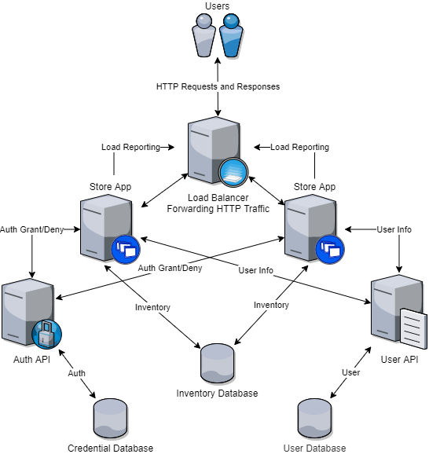

## Solution Guide: Monolithic Architectures And Issues

In this activity you developed a microservices version of an existing web store app in order to prepare for redundancy and scaling.

--- 

First, let's take a look at the original existing monolith for the web store app:

All of these servers exist in one VM.

Your microservices diagram should be similar to this:

The microservices include:

- A Store App
- A User API
- An Authentication API

You also split the monolithic database into three separate databases:

- A **User Database** that handles all user information from the store app such as preferences and sessions.

- A **Credential Database** that is used to store credential information that the **Authentication API** will check user logins against.

- An **Inventory Database** that gets updated whenever a user buys something from the store.

The microservices connect to their corresponding databases in the following ways:

- The Store App exchanges inventory info with the Inventory Database.

- The User API exchanges user info with the User Database.

- The Authentication API exchanges authentication info with the Credential Database.

Lastly, the APIs will interact with the Store App in the following ways:

- The User API forwards user info to the Store App.
- The Authentication API forwards authentication grants or denials to the Store App.

**Bonus**

If you completed the bonus, you shold have a diagram similar to the following:

In this diagram, we now have the additional microservices:

- Two replica Store Apps for redundancy and scale.
- A Load Balancer that has rules for balancing user sessions between the two replica Store Apps.

Explain new connections:

- The connections between the APIs and Store App replicas remain the same, but now there are twice as many connections.

- You may have Load Reporting connections between the Store Apps and Load Balancer. These let the Load Balancer know which Store App has less load for handling requests and responses.

- Lastly, the Load Balancer should have connections going to each Store App that show it forwarding requests and responses.

  
---
© 2020 Trilogy Education Services, a 2U, Inc. brand. All Rights Reserved.
