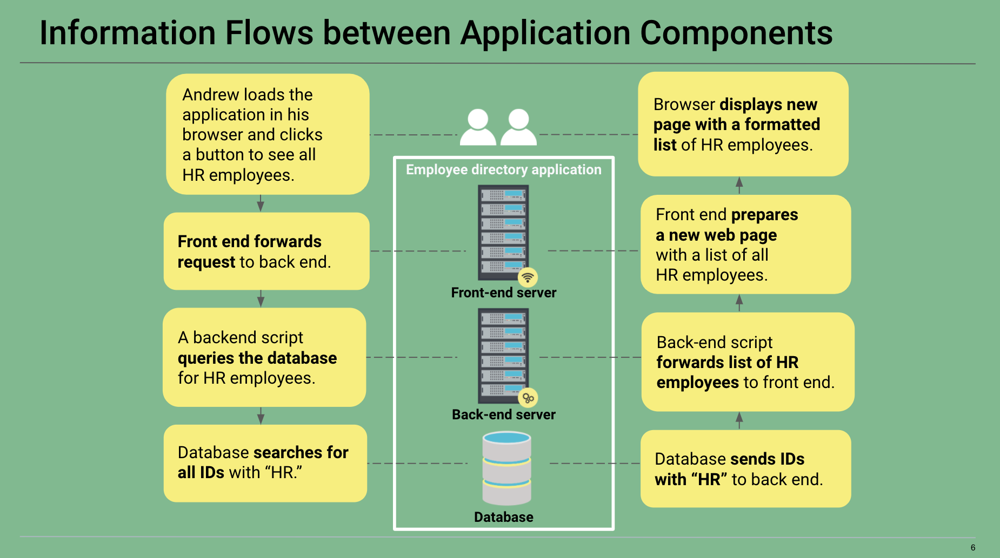
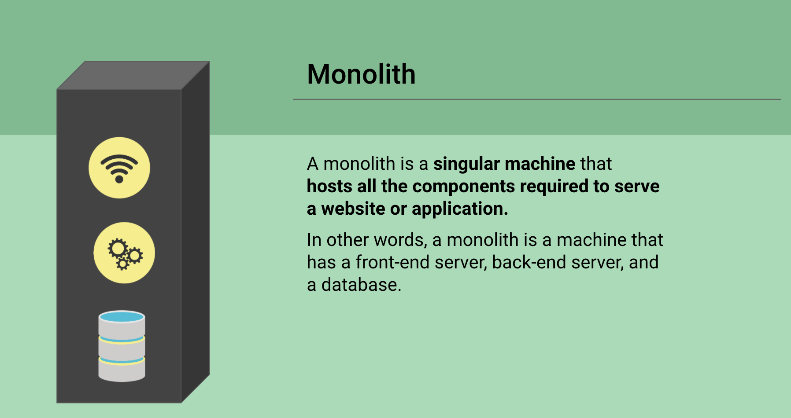
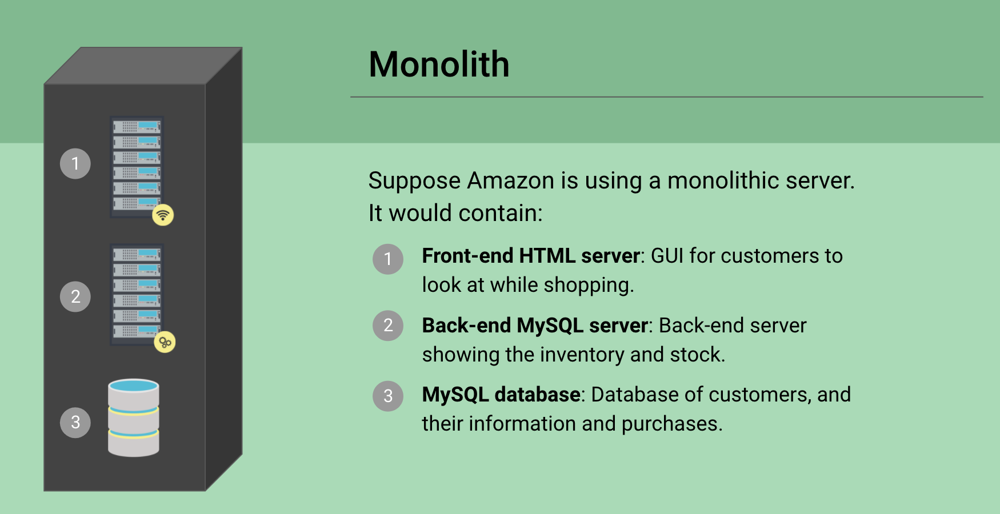
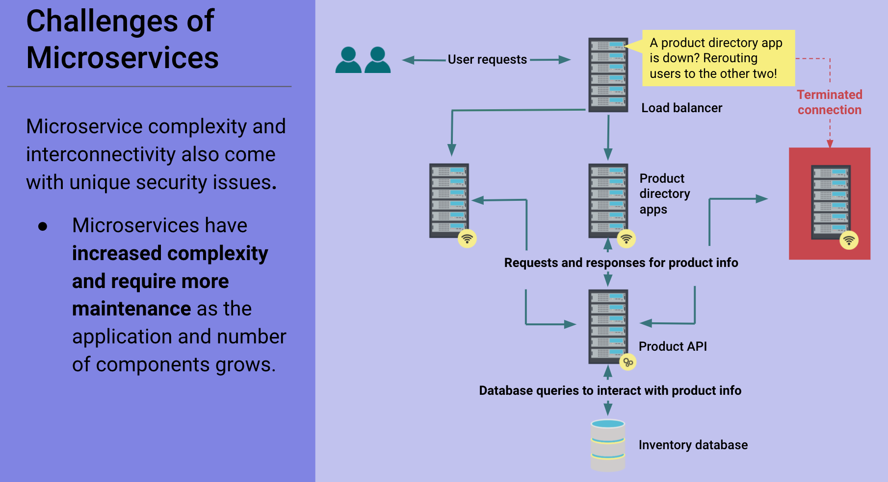
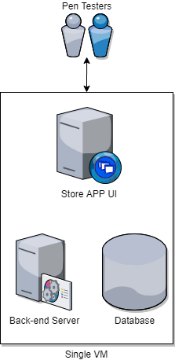
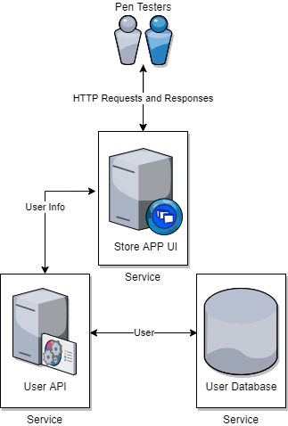
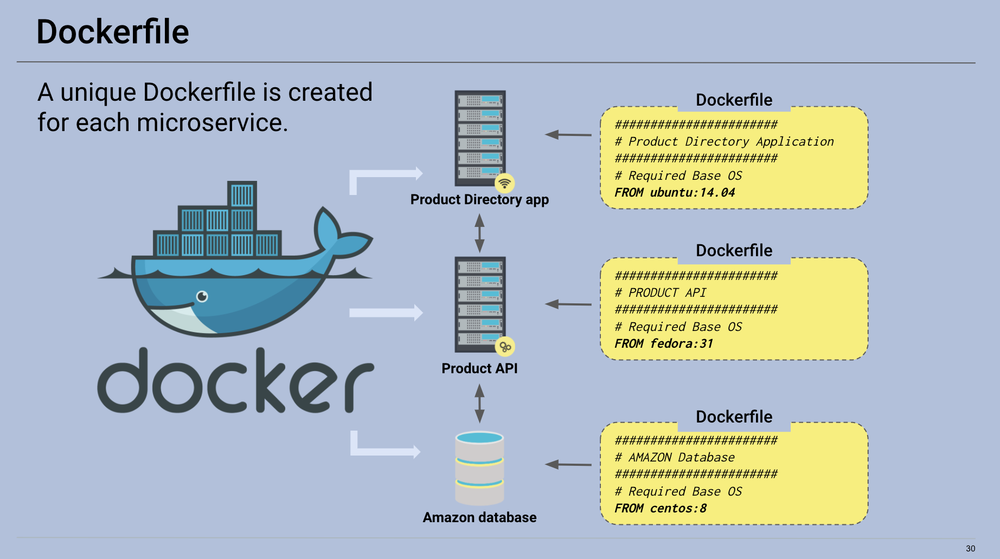
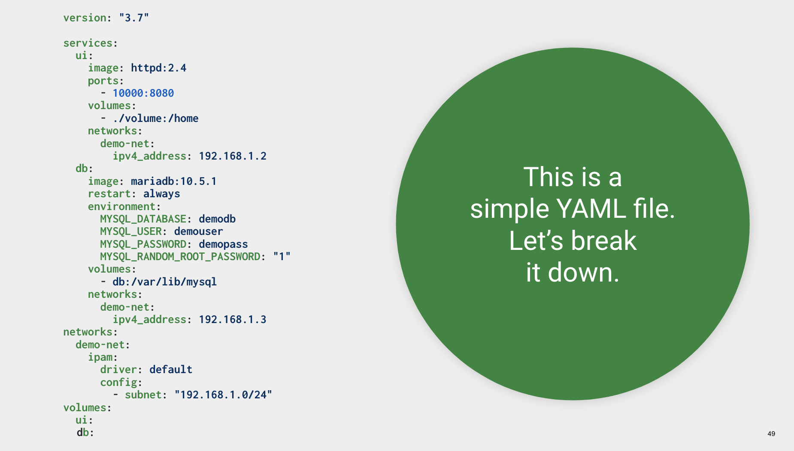

# 14.2 Student Guide: Microservices and Container Security

## Class Overview

Today's class introduces microservice architecture and, specifically, containers. We'll act as web app security engineers tasked with assessing the state of architectural security in the the DevOps process.

We'll extract vulnerability logs from containers and examine them using bash tools. Then, we'll examine Docker orchestration from a high level and test container runtime security.

### Class Objectives

By the end of class, you will be able to:

- Understand how microservices and architecture work to deliver more robust, reliable, and repeatable infrastructure as code.
- Run a container vulnerability  scan and filter through the results.
- Deploy a Docker Compose container set and test the deployment's functionality.
- Deploy a container intrusion detection system and simulate intrusions on the previously deployed container set. 


### Lab Environment   

You will use your local Vagrant virtual machine for today's activities. 

  - Student access:
    - Username:`sysadmin`
    - Password: `cybersecurity`


### Slideshow 

The slides for today can be viewed on Google Drive here: [14.2 Slides](https://docs.google.com/presentation/d/1XO_OPssMqcXOQkcYM5XwzEdvDvudw3SANxJPaut4ov0/edit).


---

### 01. Instructor Do: Reviewing Application Structure (0:05)

In the first day of this unit, we investigated and analyzed the HTTP request and response process.

Today, we will cover microservice architecture and how to secure it.

In order to understand why microservices exist, we need to cover the following:

- How an application and its components are organized.
- How information flows between components of an application.
- How the application's architecture has changed from monoliths to microservices.
- How to deconstruct a monolith into microservices.

#### Components of a Typical Web App

We will look at how an application is constructed in order to understand the paradigm shift in modern web architecture.

Consider the following scenario:

- A developer, Andrew, uses a browser to manage a public-facing application (let's call it the Employee Directory App), where he retrieves and updates different kinds of employee lists from his company. The Employee Directory App is set up so that Andrew can add, remove, and view employees.

This application needs the following components in order to function:

-  A **front-end** server, responsible for displaying webpages and styling them in a readable format. This server is also responsible for receiving and responding to HTTP requests.

- A **back-end** server, for executing business logic and writing or reading corresponding data to and from a database. The back-end server knows how to interact with the database depending on the specific request received.

  - For example, if Andrew requests to add a new employee, the back-end server knows to create a new number (e.g., 109) for the employee, and then save that information in the database. 
  
    After this, the data is sent to the front end and formatted to display: "New employee, Bob, created with employee ID, 109" in a new webpage.

- A **database**, used to store information about employees, such as their employee IDs and names.


#### Information Flows Between Application Components

Let's see how information flows between application components when Andrew requests a list of all HR employees.

- The following diagram illustrates how application components talk to one another: 

  

  1. Andrew loads the application in his browser and clicks a button to see all HR employees.

  2. Front end forwards the HTTP request to the back end.
  
  3. A back-end script queries the database for HR employees.
  
  4. Database searches for all IDs containing "HR."
  
  5. Database sends IDs with "HR" to back end.
  
  6. Back-end script forwards list of HR employees to front end.
  
  7. Front end prepares a new webpage listing all of the HR employees.
  
  8. The browser displays a new page to Andrew, with a formatted list of HR employees.

Emphasize that each component of the web application serves one primary function, whether it's serving website data over HTTP or querying the database.


### 02.  Monolith to Microservices 

Understanding _what_ components do in an application is key to understanding why microservices are so important in the modern architectural paradigm. 

First, we need to understand the original architecture type, known as **the monolith**, and its issues, in order to understand why we now use microservices.

A monolith is any machine that hosts all of the components required to serve a website or application. In other words, a monolith is a machine that has the front-end server, the back-end server, and database all on one machine.

For example, if Amazon used a monolithic server comprised of a front-end server, the back-end server, and database, it would contain:

- A front-end HTML server: A GUI for customers to use when shopping.

- A back-end MySQL server: A back-end server showing inventory and stock.

- A MySQL database: A database of customers, their information, and purchases.

Let's review what the monolith in our example looked like. 



The components of this machine are highly dependent on each other. If one component malfunctions, the application will stop working. This presents a few problems:

- If the company needs to update any of the components—the front end, back end, or database—the entire server and all of its components must be taken down. This creates long periods of downtime.

- If one component is compromised by a hacker, environmental issue, or human error, the entire machine is potentially compromised.


Today's business standards expect companies to ensure *availability* by maintaining almost 100% uptime. Because of this, Amazon decides that the monolith architecture comes with too much risk, and instead creates a more **modular** set up: a whole consisting of smaller and separate parts.

- Amazon would need to separate their components into different machines, so that system administrators and developers could deploy changes without taking entire applications down for extended periods of time.

- Separating an application's components into their own machines allows the sysadmin to update the front end, reboot it, and only have to verify the front-end components are working. They don't have to worry about the back-end components and database. If any components were compromised by a hacker, the potential damage would be restricted to only that one component.

This new approach of separating application components into their own machines is called **microservices**.

#### Microservices

So far, we've covered the typical components of an application and how the monolithic design causes maintenance and security issues. Now we want to separate our components into different machines to implement microservice architecture.

In the following scenario, Amazon's sysadmins have separated and isolated the front-end, back-end, and database components into their own machines.

- Each of the smaller blocks represent a single, independent machine. Within each machine is a component that executes one primary function or **service**.

  


We actually implemented microservices earlier in the course. Think back to the unit on cloud security, and some of the activities from the previous day. So far, we've created the following microservices:

- A jump box to connect to a private Ansible server.
- An Ansible server to configure DVWA servers.
- DVWA servers to provide the DVWA service.
- A docker image to provide WordPress.

Together, these perform the same services as the monolithic server, but without the potential vulnerabilities.

#### Benefits of Microservices

The ultimate goal of microservices is flexibility through modularity, which has the following benefits:

- **Scalability and resiliency**: Replication of identical components allows you to serve more clients and provides identical backup components if one fails.

- **Rapid response**: Since microservice components are inherently smaller than monoliths, they can be replaced and updated quickly.
  - For example, an entire VM might require 150 GB of total disk space. An individual component could have a maximum capacity of one or two hundred MB. 

- **Isolated improvement**: Since microservices should be reduced to serving one primary function, they can be developed to optimize their functionality.

  - For example: Developers working on an API for storing employee data are developing a way to create new employee accounts more quickly. They'll be able to work directly on this API, without the need of a front end to view it. 

- **Isolated security:** One compromised component does not equal a compromised application.


#### Creating an API

In previous cloud security and web development classes, we used Ansible in combination with SSH to communicate between our servers.

- This is a relatively simple process, but not every system uses Ansible to communicate.

- Most systems use **application programming interfaces (APIs)**.

Consider the following scenario:

- When an Amazon customer wants to retrieve a list of the newest and most popular books, they don't go to the back-end MySQL server to check the inventory. They use the front-end microservice. The microservice then communicates with the back-end server containing that data, and brings it up.

- In other words, customers do not have access to the back-end server. The back end does not accept HTTP requests, meaning users can't communicate with it.

- However, Amazon system administrators do need to access and query the back end in order to update product information. Since they need to directly communicate with the back end, they must modify it to accept requests.

- Amazon software developers will program the back end to receive, from sources other than the front-end server, HTTP requests to add, remove, and view product information.

In this example, the back-end server is an example of an application programming interface (API).

- An API is the implementation of new protocols or features onto an existing software application to alter the way that application is used or accessed.

- In the previous example, the software developers modified the back end to receive HTTP requests from sources other than the front end.

 We can call this back end the Product API.

  

The back-end server can now process HTTP requests and responses for product info. However, the front-end server will still send requests and responses for customers requesting product info over the open web as usual.

**Finalizing New Components and Functions**

We have turned our monolith into various microservices. Now we will to rename the front-end server and database to match their specialized services.  

- The front-end server provides the service of displaying the application to users through a browser, so we'll now call it the Product Directory API. 

- The database stores product info, so we'll call it the Amazon Database.


How we separated a monolith into microservices:

1. Separated each component of the monolith by function, moving it into its own machine.
2. Added communication between each microservice.
3. Turned the back-end server into an API to interact with more than just the front end.
4. Renamed the rest of the component services to match their main functions.


Microservice complexity and interconnectivity also come with unique security issues, which we'll cover in more depth later.


#### Challenges of Microservice Scaling

A primary challenge of microservices is the increase in complexity and required maintenance as the application and number of components grow.

- For example, suppose there are multiple directory apps for redundancy and one of the app services needs to be taken down for maintenance.

  

- To maintain the third app service, you have to ensure that no new clients are connecting to it, upgrade it, then re-establish its communications within the entire microservice deployment.

- This process is more complex than running a command to download and install all updates and then rebooting a monolithic server. However, it is faster. With the proper setup, it causes no service interruptions.

The solution is to set up a load balancer, which we will do later in the lesson. 

We'll now look at how to separate a monolith into microservices using the online diagramming tool, draw.io.

#### Diagramming Microservices

In the following activity, you will review a diagram of a monolithic application and transition it into a microservice setup.

- As an example, look at the same application set up as a monolith and as a set of microservices:


  

  

If any component of the monolith was compromised, the entire application would be compromised. Therefore, it is separated into the following components:

- A Store App UI to serve as the front-end service
- A User API to serve as the back-end service
- A User Database

To make these changes on a diagram, we would:

1. Separate each component of the monolith by its function and make it its own machine.

2. Add communication between each part of the microservice.

3. Add the back-end server to an API to interact with more than just the front end.

4. Rename the rest of the component services based on the main function they provide.


### 03.  Monolith to Microservices Activity

- [Activity File: Monolith to Microservices](./Activities/03_Monolith_to_Microservices/Unsolved/README.md)

- [Draw.io Diagram Template](./Activities/03_Monolith_to_Microservices/Unsolved/activity_one_unsolved.drawio)

### 04. Review Monolith to Microservices Activity 


- [Solution Guide: Monolith to Microservices](./Activities/03_Monolith_to_Microservices/Solved/README.md)


### 05. Container Vulnerability Analysis with Trivy and Bash 

In the last activity, we separated a monolith into microservices in order to understand modern web architecture. One of the first steps to creating microservices is separating the components into their own individual machines.

In this section, we will find vulnerabilities in these individual machines. First, we need to understand the technology that they are built on.

#### Microservices Infrastructure with Containers

Microservices require lightweight environments to run on because:

- Live services need to be deployed quickly.
- Multiple copies of a service can be replicated as needed to meet demand.
- Developers and maintainers can deploy their own copies of these services locally for their own testing purposes.
- Full-sized VMs for each service requires more resources and costs more.

This is why we give each service its _own_ lightweight virtual environment.

Remember that in a previous class, we've covered a technology that can create isolated virtual environments.

- Lightweight virtualization environments exist in the form of **containers**.

- In the cloud security unit, we covered containers and Docker extensively. We also used Ansible to set up lightweight containers in our activities.

- Containers run as isolated, virtual operating systems that dynamically allocate resources depending on the container's needs. These are unlike regular virtual machines, where all of the hardware is virtualized.

- Docker is the most popular container platform. For the rest of this lesson, we will be using Docker's implementations of containers.

Using containers is the the primary way microservices are developed.

#### How a Container Becomes a Microservice

**Containerization** is the process of packaging all of the requirements to set up a microservice into a container.

Containerizing a microservice does the following:

- Declares a base operating system for the microservice to run on.
- Copies the microservice's source code to the container.
- Sets a command that launches the microservice.

This containerization process is declared in a simple text file called a Dockerfile.

- Dockerfiles contain all of the configuration needed for a container in one file, similar to how an Ansible configuration file contains everything it needs to configure a host when you run the command `ansible-playbook your-playbook.yml`.

In the case of the Amazon Product microservices that we saw before, we would create a separate Dockerfile for each of the microservice components.

- Consider the following example sample of a Dockerfile:

 ```Dockerfile
 ###############################
 # Product Directory Application
 ###############################
 # Required Base OS
 FROM ubuntu:14.04
 ...[truncated]
 ```

- In this Dockerfile, Docker will install an Ubuntu 18.04 image to serve as a base operating system for the microservice.

A unique Dockerfile will be created for each microservice:

  

It isn't very important that we know how to construct or maintain a Dockerfile at this time. But we should understand that these Dockerfiles can be repeatedly used to create and configure the same microservice, similar to what Ansible playbooks do for Ansible.


#### Security Issues in Containers

Dockerfiles contain all the configurations to set up a container, but we also need a way to ensure that the configurations of the container do not come with any security risks.

First, we need to understand some important concepts of container security.

 ```Dockerfile
 ###############################
 # Employee Directory Application
 ###############################
 # Required Base OS
 FROM ubuntu:14.04
 ...[truncated]
 ```

- The security issues are inherited from the underlying operating system to the application.

- In the above Dockerfile, we can see that Ubuntu 14.04 is the base operating system of the application. Therefore, all security issues that are present in Ubuntu version 14.04 will also exist in this container.

In order to address these issues, we will use a tool called **Trivy** to scan Dockerfiles and Docker images and create a list of known security issues.


#### Interactive Trivy Demo

Now that we know how these microservice components are configured through Dockerfiles, we're going to look at how to use the command-line tool Trivy to scan containers for vulnerabilities.

These vulnerabilities include, but are not limited to:

- **Man-in-the-middle (MITM)**: An attacker secretly intercepts and relays requests between a victim and their intended target, such as a website.
- **Buffer overflow**: A software anomaly in which the memory of an application can be corrupted and have foreign code executed as a part of memory.
- **Denial of service (DoS)**: Takes down a service and makes it unavailable.
- **Privilege escalation**: Enables an attacker to escape the regular user space of an operating system to run commands with elevated privileges.

In this demo, we will be looking for MITM vulnerabilities. In the activity, we will looking for buffer overflows, denial of service, and privilege escalation vulnerabilities.

Scanning container images and Dockerfiles before they are deployed for vulnerabilities is called **vulnerability scanning**.

- Vulnerability scanning is one of the earliest stages within an application's deployment cycle that a security engineer becomes involved.

In the following demo we will be looking at how to use the vulnerability scanning tool Trivy to scan through an intentionally vulnerable Docker image.

- Using Trivy is quite simple, but the most important part is filtering through the results for the most critical security risks.

- We'll be using the bash command-line tool `jq` to do this.

**Trivy Installation**

Open a new terminal, create and navigate to to a new directory called `~/Documents/demo`.
- Run: `mkidr ~/Documents/demo`
- Run: `cd ~/Documents/demo`

We are going to point Trivy to a Docker Hub image repository that hosts intentionally vulnerable Docker images and Dockerfiles.

- Copy the following command into your terminal: `trivy knqyf263/vuln-image:1.2.3`

- This command will search for vulnerabilities that exists in DockerHub account `knqyf263`'s Docker image `vuln-image:1.2.3`.

- The output of the command should resemble the following:

    ```console
    knqyf263/vuln-image:1.2.3 (alpine 3.7.1)
    ========================================
    Total: 26 (UNKNOWN: 0, LOW: 3, MEDIUM: 16, HIGH: 5, CRITICAL: 2)

    +---------+------------------+----------+-------------------+---------------+----------------------------------+
    | LIBRARY | VULNERABILITY ID | SEVERITY | INSTALLED VERSION | FIXED VERSION |              TITLE               |
    +---------+------------------+----------+-------------------+---------------+----------------------------------+
    | curl    | CVE-2018-14618   | CRITICAL | 7.61.0-r0         | 7.61.1-r0     | curl: NTLM password overflow     |
    |         |                  |          |                   |               | via integer overflow             |
    +         +------------------+----------+                   +---------------+----------------------------------+
    |         | CVE-2018-16839   | HIGH     |                   | 7.61.1-r1     | curl: Integer overflow leading   |
    |         |                  |          |                   |               | to heap-based buffer overflow in |
    |         |                  |          |                   |               | Curl_sasl_create_plain_message() |
    +         +------------------+          +                   +---------------+----------------------------------+
    ...[truncated]
    ```

The output returns too many results. As security engineers, we need to to be able to filter down these type of vulnerability lists and output the results to readable files.


We'll now modify the Trivy command so that it will output all security vulnerabilities classified as medium severity in JSON format, to a file called `results.json`.

- Run the following command: `trivy --format json --output results.json --severity MEDIUM knqyf263/vuln-image:1.2.3`

  - `trivy`: The service we are running.
  - `--format json`: Formats the output of the scan to JSON format.
  - `--output results.json`: Specifies the name of the file to save the output to.
  - `--severity MEDIUM`: Makes sure to only output vulnerabilities with a severity class of `MEDIUM`.
  - `knqyf263/vuln-image:1.2.3`: The Docker image that we are checking.

- The output should look like:

  ```
  instructor@ubuntu-desktop-base:~$ trivy --format json --output results.json --severity MEDIUM knqyf263/vuln-image:1.2.32020-03-23T13:56:40.131-0400	INFO	Detecting Alpine vulnerabilities...
  2020-03-23T13:56:40.133-0400	INFO	Detecting composer vulnerabilities...
  2020-03-23T13:56:40.134-0400	INFO	Detecting bundler vulnerabilities...
  2020-03-23T13:56:40.141-0400	INFO	Detecting npm vulnerabilities...
  2020-03-23T13:56:40.141-0400	INFO	Detecting pipenv vulnerabilities...
  2020-03-23T13:56:40.144-0400	INFO	Detecting cargo vulnerabilities...
  2020-03-23T13:56:40.145-0400	WARN	This OS version is no longer supported by the distribution: alpine 3.7.1
  2020-03-23T13:56:40.145-0400	WARN	The vulnerability detection may be insufficient because security updates are not provided
  ```

Medium severity means that these vulnerabilities aren't the most critical security risks, and that if an attacker leverages these vulnerabilities, the damage to the system will be limited.

You will be looking for high and critical severity vulnerabilities in the activity.

#### Bash Filtering with `jq`

Now that we know how to use the Trivy command, we want to see how we can filter the results using bash command-line tools.

We will need to use the command-line tool `jq` to inspect the `results.json` file that we created with Trivy.

- `jq` is like `sed`, but for JSON data. It is used to filter through JSON files and has the same text editing functionalities that are built into `sed`, `awk`, and `grep`.

- JSON is a structured data format that is used ubiquitously within software development languages, logging, and security.

A security engineer will often have to filter through JSON logs in order to find the most relevant information for an organization.

We won't need to know JSON in-depth, but that they will need to know how to interact with it in order to use `jq` to filter through these vulnerability reports.

#### JSON

JSON is language-agnostic, and its pure data format also makes it the standard for web services and APIs. Those looking into web application security roles should get comfortable using JSON.

It is also used in all log aggregators, such as ELK and Splunk. In order to work with other platforms, every log transporter and collector understands and ingests JSON.

Note the following about JSON formatting:

- It writes objects as `key:value` pairs.
- Data is separated by commas. 
- Curly braces hold objects.
- Square brackets hold arrays.

 JSON's key-value format as follows:

```JSON
{ "key":"value" }
```

The following is a JSON object with an array inside:

```JSON
{
"thisIsAKey":"this is a value",
"theFollowingIs":"an_array_example",
"ciaTriad":[ "confidentiality", "integrity", "availability" ]
}
```

We now have a `results.json` file with all of the medium severity vulnerabilities from the Docker image.

We can now use the bash command `jq` to filter for certain types of vulnerabilities.

- Install `jq` by running: `sudo apt install jq`

The `Vulnerabilities` object that contains all of the vulnerabilities that lie within the first array.

- Type `jq '.[0].Vulnerabilities' results.json`

  - `.`: Before every object and array, we use a dot (`.`) to tell `jq` what level of the JSON we're looking in.
  - `.[0].Vulnerabilities` means that we're are going to look in the first array, `.[0]`, for all objects under the object `.Vulnerabilities`. 

Run the command. We can find the individual vulnerability information such as:

  - `VulnerabilityID`: The Common Vulnerabilities and Exposures ID (CVD). This is a unique ID given to every known vulnerability. It is maintained by a branch of the National Security Agency.

  - `PkgName`: Contains the package name that is vulnerable. For example, if `sed` had a vulnerability, we would see `PkgName: sed`.

  - `InstallVersion`: The version of the vulnerable package.

  - `FixedVersion`: The fixed version of the package. This is the version a security engineer would recommend updating to.
  
  - `Title`: The title of the vulnerability. This often contains the type of vulnerability as well, such as `remote code execution`.
  
  - `Description`: The description of the vulnerability. This contains information about how an attacker might leverage the vulnerability. We'll filter these for more information.
  
  - `Severity`: The severity of the vulnerability describes the potential risk to the system it is installed on. The more damage it can cause, the more severe the vulnerability.
  
  - `References`: Contain links that can be followed to websites to find more information about the vulnerability.

If we wanted to use `jq` to retrieve a count of all vulnerabilities, we would use the following command:

- Run `jq '.[0].Vulnerabilities | keys' results.json`

We can use the command from earlier and add a piped filter to search through our JSON file to create a new vulnerability-specific JSON file.

- We will now create a command that will search through all `Descriptions` for the term "Man-in-The-Middle." All of the results will be piped into a new `results_mitm_vulns.json` file.

- Run `jq '.[0].Vulnerabilities[] | select(.Description | test("Man-in-The-Middle"))' results.json > results_mitm_vulns.json`

  - `.`: Tells `jq` what level of the JSON we're looking in.
  - `.[0].Vulnerabilities` means that we're are going to look in the first array, `.[0]`, for all objects under the object `.Vulnerabilities`. 
  - `select(.Description)`: Filters through all of the keys and outputs each corresponding description section of JSON.
  - `test("Man-in-The-Middle")`: Continues to filter the `select` output for the words "Man-in-The-Middle" in the values of the JSON file.
  - `results.json`: The file we are parsing.
  - `> results_mitm_vulns.json`: Sends the results to a new file named `results_mitm_vulns.json`.

We can then use `jq` to check the new file.

- Run `jq . results_mitm_vulns.json`

Note that there should be two vulnerabilities listed with "Man-in-the-Middle" in the description.

For the following activity, we can replace the man-in-the-middle vulnerability type with another, such as buffer overflow, and run the command again.

We'll now use Trivy and bash tools to examine JSON logs to find vulnerabilities of certain types and output each type to a new JSON file.

### 06. Container Vulnerability Analysis Activity with Trivy and Bash 


- [Activity File: Container Vulnerability Analysis with Trivy and Bash](Activities/06_Container_Vulnerabilities_Analysis/Unsolved/README.md)

### 07. Review Container Vulnerability Analysis with Trivy and Bash Activity 

- [Solution Guide: Container Vulnerability Analysis with Trivy and Bash](Activities/06_Container_Vulnerabilities_Analysis/Solved/README.md)


### 08.  Deploying and Testing a Container Set 

While we now know how to set up a single container, deploying containers one at a time can become tedious and unwieldy, especially if businesses require hundreds or thousands of microservices.

Therefore, we need to know how to deploy containers in large-scale environments. Specifically, we need to know how to:
- Deploy multiple _types_ of containers at the same time (for example, front-end and database services).
- Deploy multiple _copies_ of containers that we want replicated.
- Set up a network for our containers so that they can communicate with each other.

Docker Compose is a tool that enables these larger-scale deployments.
- You should remember Docker Compose from setting up our WordPress site in the last class.
- Docker Compose is a tool that can deploy multiple containers at once and then configure them.

Let's look at how Docker Compose allows us to to create repeatable, multi-container deployments.

#### The Docker Compose YAML File

Do you remember using YAML to deploy Ansible playbooks during their cloud security unit?

- Docker Compose uses YAML to define the containers for a deployment, their networking configuration, and where you will copy files from your host machine into the container.

- Docker Compose also uses the same YAML file type to declare container configurations. These files are often saved as `docker-compose.yml`.

It isn't absolutely crucial for you to understand in-depth how a YAML file is constructed. But, you will be examining and editing one for their activity, so you'll need to know where to find certain configurations.

####  Docker Compose Demo

In this demo, we will use Docker Compose to deploy multiple containers at the same time, check our deployment, then redeploy our containers with new configurations.

Specifically, we'll complete the following steps:

- Examine our YAML file for its current configurations.
- Launch our services with `sudo docker-compose up`.
- Use our browser to verify that our front-end user interface (UI) services are deployed properly.
- Test the deployment of our database service.
- Change the configuration of our UI service so that it displays through a different port.
- Test the new UI service's functionality with our browser.


#### Launching the Demo Deployment

**Instructor Note:** These initial steps of depicting a YAML file will be displayed on the slides.

We will look at how this YAML file configures the user interface UI (`ui`) and database (`db`): 


  

  ```YAML
  version: "3.7"

  services:
    ui:
      container_name: demo-ui
      image: httpd:2.4
      ports:
        - 10000:8080
      volumes:
        - ./volume:/home
      networks:
        demo-net:
          ipv4_address: 192.168.1.2
    db:
      container_name: demo-db
      image: mariadb:10.5.1
      restart: always
      environment:
        MYSQL_DATABASE: demodb
        MYSQL_USER: demouser
        MYSQL_PASSWORD: demopass
        MYSQL_RANDOM_ROOT_PASSWORD: "1"
      volumes:
        - db:/var/lib/mysql
      networks:
        demo-net:
          ipv4_address: 192.168.1.3
  networks:
    demo-net:
      ipam:
        driver: default
        config:
          - subnet: "192.168.1.0/24"
  volumes:
    ui:
    db:
  ```

- This YAML file can be broken down by the services it installs, the user interface, and the database:

  ```YAML
  services:
    ui:
    db:
  ```

In this YAML file, the `ui` and `db` are services. Each of these services are container configurations. Let's take a look at the first one:

  ```YAML
    ui:
      container_name: demo-ui
      image: httpd:2.4
      ports:
        - 10001:8080
      volumes:
        - ./volume:/home
      networks:
        demo-net:
          ipv4_address: 192.168.1.2
  ```

- `container_name`: specifies the name of the container. If not specified, Docker will automatically name the container using the currently directory and services name. This definition allows us to have explicable container names for when we use commands such as `docker exec`.
- `image`: Points to where Docker Compose will grab the container image from on Docker Hub, which will be Apache's `httpd` container. This is equivalent to `FROM ubuntu:14.04` from the Dockerfile we looked at earlier.
- `ports - 10000:8080`: The container's HTTP port is remapped to the container's `8080` port, which is then being forwarded to the host's `10000` port. After which, we should be able to see web pages in our browser at `localhost:1000` due to how `httpd` works.
- `volumes: - ./volume:/home `: The local destination where the Apache server will save our configuration files.
-  `networks: demo-net`: The network that this service will connect to. We'll take a look at this configuration in more detail in a moment.
- `ipv4_address: 192.168.1.2`: The static IP address that we are assigning to this container, which we'll be able to load up into our browser.

#### Standing Up Scaled Services

Now that we have an idea of how Docker Compose YAML files are constructed, let's see how `docker-compose` actually stands it all up.

- Navigate to `/home/instructor/Cybersecurity-Lesson-Plans/14-Web_Dev/deploying_testing_demo`.

The following command will find a `docker-compose.yml` file in the current directory and spin up the container configured within it.

- Run `sudo docker-compose up`

- Note that through one argument, we can deploy multiple copies of a container if the configurations allow for it.

- Docker Compose's execution is now taking over the terminal.

- `docker-compose up` will look for a `docker-compose.yml` file in the current directory and deploy it.

Return to the `docker-compose.yml` file. We will now inspect the `ui` configuration section.

- Open FireFox and navigate to `192.168.1.2`, which is the IP address we assigned to our recently created container.

- When you navigate to it, you should be greeted with a webpage that says `It works!`. Refresh the page.

We can use the browser to verify that the duplicate `ui` services are running too.

- Return to the terminal that is running `docker-compose` to show that there are indeed HTTP GET requests received by our various `ui_#` services. Note the different `ui_#` numbers as our scaled `ui` services.

For the activity, you will need to investigate their YAML file and then verify that their application's deployment works in the browser.

Provide a brief overview of the database service. It is not essential that we understand and create services on their own, but we should understand what the different lines mean.

```YAML
  db:
    container_name: demo-db
    image: mariadb:10.5.1
    environment:
      MYSQL_DATABASE: demodb
      MYSQL_USER: demouser
      MYSQL_PASSWORD: demopass
      MYSQL_RANDOM_ROOT_PASSWORD: "1"
    volumes:
      - db:/var/lib/mysql
    networks:
      demo-net:
        ipv4_address: 192.168.1.3
```

- `demo-db`: Is the name of our container.
- `image: mariadb:10.5.1`: The container image and version we'll be using (MariaDB database version 10.5.1).
- `environment`: Contains the setup of the MySQL server.
- `MYSQL_DATABASE: demodb`: The name of the database.
- `MYSQL_USER: demouser`: The default user for the MySQL database.
- `MYSQL_PASSWORD: demopass`: The password for the user.
- `MYSQL_RANDOM_ROOT_PASSWORD: "1"`: Gives the root user a random password, for security purposes.
- `volumes: - db:/var/lib/mysql`: The location where we are saving our configuration files.
- `networks`: Using the same network (`demo-net`), assigns this database a static IP address.

The top-level `networks` is an application-wide configurations that can be accessed by each service.

#### Logging into MariaDB

Navigate back to the `home/instructor/Cybersecurity-Lesson-Plans/14-Web_Dev/deploying_testing_demo/` directory.

Now, we’ll check the `db` service deployment.

First, we need to get the name of our database container.
- Run `sudo docker container ls`
    - This command will let us see the names of our containers. Note the `demo-db` container result.
- Type `sudo docker exec -it docker-compose.yml`

  - This command lets us enter an interactive bash session in our containers.

- Run `sudo docker exec -it demo-db bash`

  -  Notice the prompt now includes `root`, which signifies our new shell session.

- Open a new terminal and run: `cat home/instructor/Cybersecurity-Lesson-Plans/14-Web_Dev/deploying_testing_demo/docker-compose.yml`

We can find declared database credentials here in the YAML file under the `environment` sub-heading.

```YAML
  db:
    container_name: demo-db
    image: mariadb:10.5.1
    restart: always
    environment:
      MYSQL_DATABASE: demodb
      MYSQL_USER: demouser
      MYSQL_PASSWORD: demopass
      MYSQL_RANDOM_ROOT_PASSWORD: "1"
    volumes:
      - db:/var/lib/mysql
    networks:
      demo-net:
        ipv4_address: 192.168.1.3
```

Navigate back to the container bash session and type `mysql -u demouser -pdemopass` to enter the database.

- This command will let us use the username `demouser` found in our YAML file.

- The `-p` parameter denotes a password, and we will use the `demopass` password declared in our YAML file.

If the prompt changes to `MariaDB`, this confirms we're now in a successfully deployed MariaDB database.

### 09. Deploying and Testing a Container Set Activity

- [Activity File: Deploying and Testing a Container Set](Activities/09_Docker_Compose/Unsolved/README.md)
- [Docker Compose File](Activities/09_Docker_Compose/Unsolved/docker-compose.yml)


### 10. Review Deploying and Testing a Container Set Activity


- [Solution Guide: Deploying and Testing a Container Set](Activities/09_Docker_Compose/Solved/README.md)


### 11.  Container Runtime Intrusion Detection Systems 

Let's recap everything we've learned so far today:

- How to separate a monolith into microservices.
- How to run a vulnerability scan on containers and filter the results.
- How to deploy and test a container set.

Now we will combine our previously deployed container set with a container intrusion detection system known as Falco.

Let's briefly review intrusion detection systems, which we covered extensively in our network security units.

- An intrusion is any unwanted malicious activity within our network or on your systems.

- An **intrusion detection system (IDS)** is a device or software application that monitors a network or system for malicious activity.

- A **host-based intrusion detection system (HIDS)** detects intrustion attempts on an endpoint device. OSSEC is an HIDS that we've worked with in class.

- A **network intrusion detection system (NIDS)** detects intrusion attempts within a network.

#### Container Intrusion Detection Systems

Containers share the same vulnerabilities as a regular VM. We learned how to find these vulnerabilities in our scan and filtering activity.

- However, the attack surface of containers is multiplied by the amount of containers deployed.

- As we saw with the previous demo, we could easily deploy four identical web servers with Docker Compose. Each one of these is a potential attack target.

Even though we scanned container Dockerfiles for vulnerabilities, we haven't done anything to secure the containers once they are deployed.

- After container sets are deployed with tools like Docker Compose in live environments, we need to be able to detect intrusions.

- Similar to NIDS and HIDS, **container intrusion detection systems (CIDS)** detect intrusions on deployed containers.

- The specific CIDS we will use today is called Falco.

#### Falco

Falco is an open-source CIDS that alerts security professionals of potential intrusion attempts, much like a normal network intrusion detection system.

Some common intrusion behaviors specific to containers:

- A new shell running inside a container. Unknown shells starting in containers is a potential sign that an attacker has gained access to a system and will start executing commands.

- When sensitive files, such as `/etc/shadow`, are read. At no point during a container deployment should the contents of `/etc/shadow` be read. This is a clear sign that an attacker is retrieving the hashed passwords of accounts within the system.

- Unprompted configuration changes. After an attacker gains access to a system, they will often create a user in order to maintain persistence within that system.

- File creations at `/root` or `/`. At no point during a container's runtime should new files be created in the `/` or `/root` directories. Files created in these directories indicate compromise.

For the upcoming demo, we will use our previous Docker Compose deployment with Falco to simulate an intrusion attempt and monitor the results.

#### CIDS Demonstration

First, we’ll redeploy the container set with `sudo docker-compose up`. Then, we’ll use Falco with a `falco.sh` shell script in the  `/home/instructor/Cybersecurity-Lesson-Plans/14-Web_Dev/falco_demo directory`.

- Navigate to `home/instructor/Cybersecurity-Lesson-Plans/14-Web_Dev/deploying_testing_demo/`.

We’ll redeploy our container set again as testing containers for simulated intrusions.

- Run `sudo docker-compose up` to bring up the containers.

Now, we’ll want to run the Falco script and verify that it runs smoothly.

- Run Falco by navigating to the  `/home/instructor/Cybersecurity-Lesson-Plans/14-Web_Dev/falco_demo  directory`.
  - Run: `cd /home/instructor/Cybersecurity-Lesson-Plans/14-Web_Dev/falco_demo`

  - Run: `./falco.sh`

- Once the machine starts running, the terminal is ready to display container intrusion alerts.

We can demonstrate the Falco shell spawn rule by running the usual command to enter an elevated bash session in a container.

- In another terminal, run `sudo docker exec -it wp bash`.

- In the Falco terminal, there's a new alert for a potential shell spawn attempt.

- The first word in the alert is the severity level. You will need to check these in their activity. 

For the final activity, we will set up and use Falco to test more rules using basic Linux commands that simulate intrusions.


### 12. Container Intrusion Detection Systems Activity

- [Activity File: Container Intrusion Detection Systems (CIDS)](Activities/12_CIDS/Unsolved/README.md)

### 13. Review Container Runtime Intrusion Detection Systems (CIDS) Activity 

- [Solution Guide: Container Intrusion Detection Systems (CIDS)](Activities/12_CIDS/Solved/README.md)


### 14.  Next Week's Azure Lab Setup

In the next unit, we will be using a web vulnerabilities Azure lab environment. 

- Inside of the web vulnerabilities environment, you will find two nested VMs: A Kali Linux instance and a machine called owaspbwa.

The owaspbwa machine hosts the vulnerable web applications that we will use throughout the class, but we will not log into it. Instead, we will perform all of our work on the Kali Linux instance.

  - Student credentials for the Kali machine:
    - Username: `sysadmin`
    - Password: `cybersecurity`

Make you are set up and can access this environment before the next class. 

---

© 2020 Trilogy Education Services, a 2U, Inc. brand. All Rights Reserved.  
